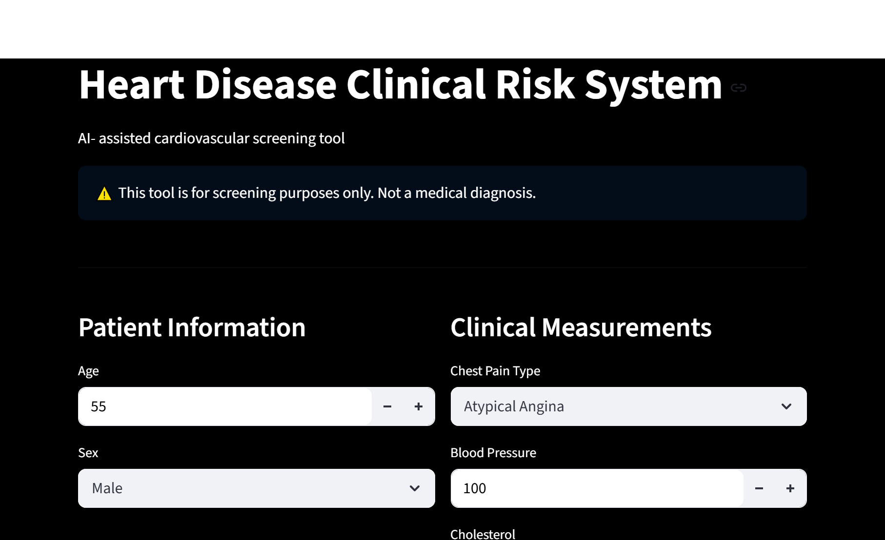
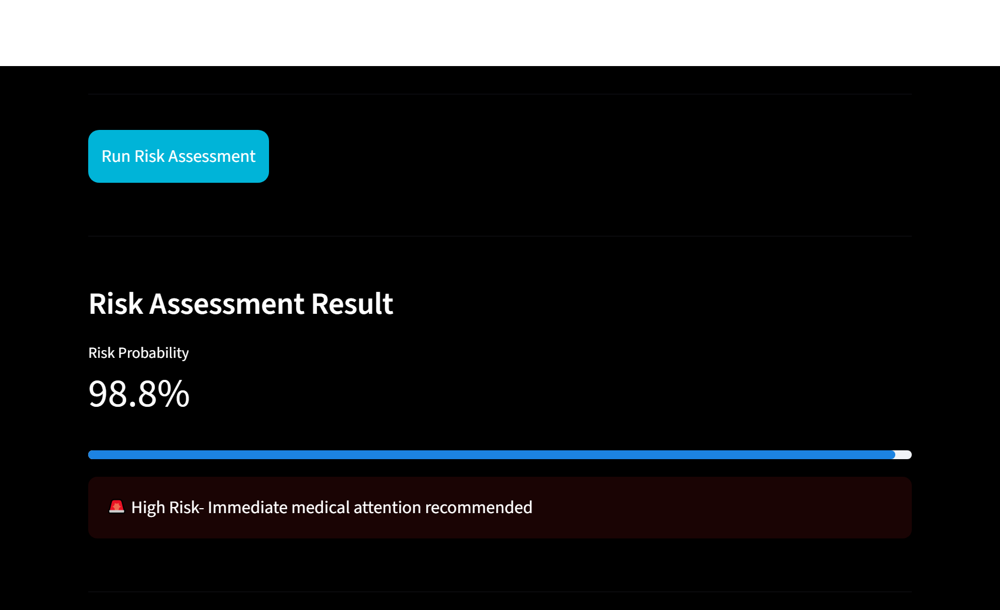
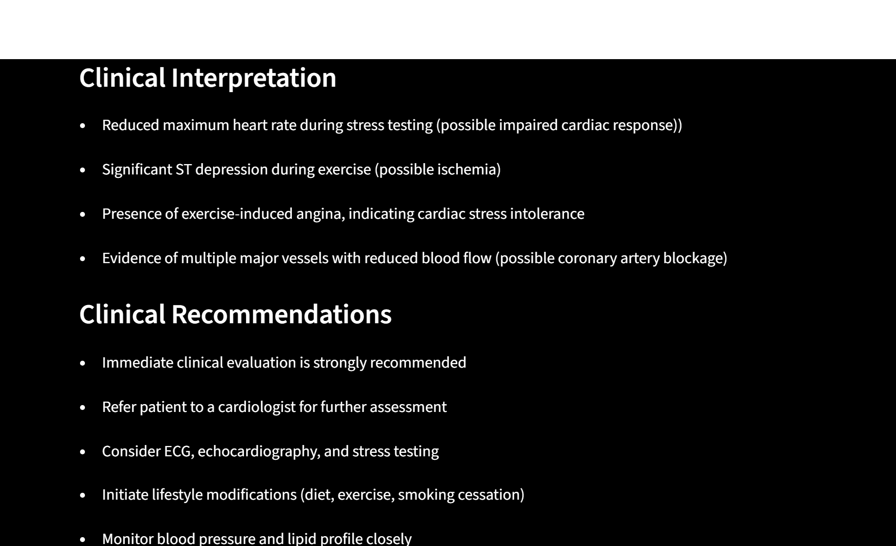
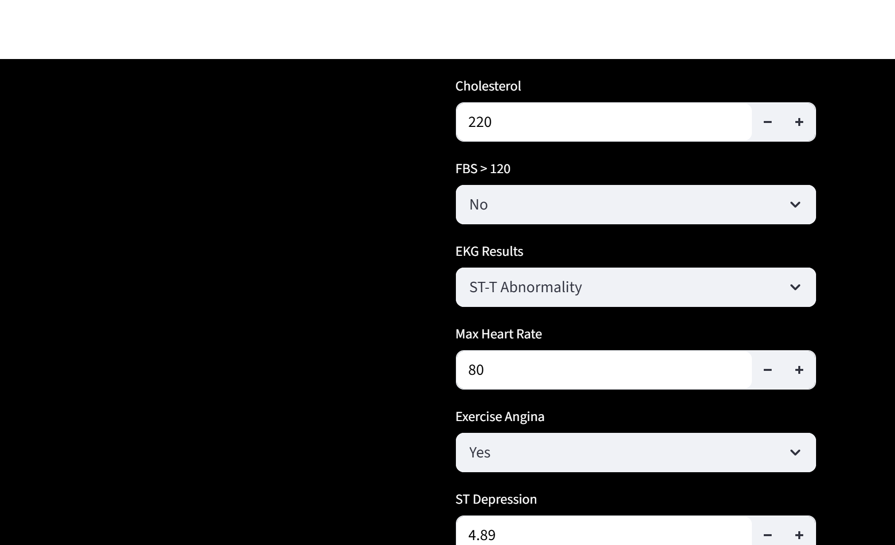
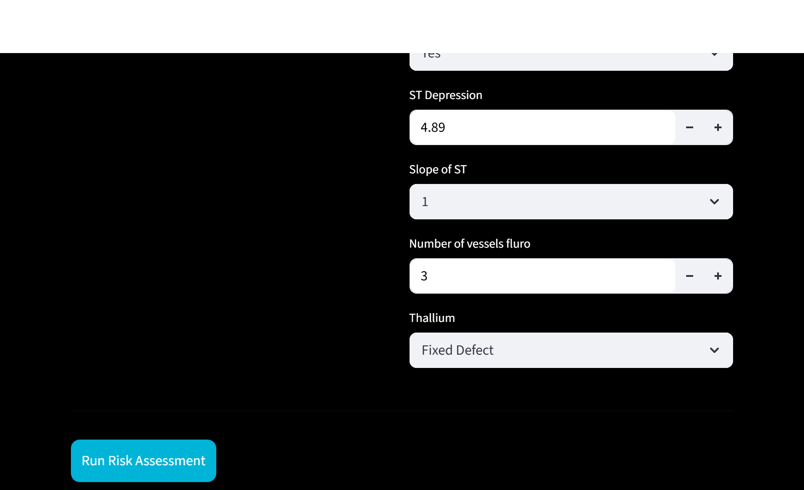

# Heart Disease Prediction System

## Overview
This project is a machine learning system designed to predict the likelihood of heart disease based on clinical patient data.
The model takes in medical features such as age, blood pressure, cholesterol level, and other indicators, and outputs a probability score indicating the risk of heart disease. Based on this probability, patients are grouped into risk categories (low, moderate, high).
In addition to prediction, the system provides basic health guidance and highlights key contributing factors.

## Features
- Predicts heart disease risk using machine learning
- Provides probability-based risk scoring
- Classifies risk into low, moderate, high
- Explains key contributing factors
- Gives personalized health recommendations
- Interactive web app built with Streamlit

## Purpose of the Project
The goal of this project is to explore how machine learning can support early detection of heart disease.
Rather than providing a diagnosis, the system is intended as a decision-support tool that can:
- Identify individuals at risk
- Encourage early monitoring and intervention
- Demonstrate how data-driven models can be applied in healthcare

## How It Works
1. The dataset is loaded 
2. The target variable (Heart Disease) is separated from input features
3. The data is split into training and validation sets
4. Multiple models are tested and compared
5. The best-performing model (Logistic Regression) is selected
6. The model is trained and saved as a `.pkl` file
7. The model is used to make predictions on new data
8. Predictions are converted into:
   - Risk probability
   - Risk category
   - Basic health recommendations

## Project Structure
 How to Run the Project

### 1. Train the model
This will:
- Train the model
- Evaluate performance
- Save the model in the `models/` folder

### 2. Run predictions
This will:
- Load the trained model
- Generate predictions
- Display risk levels and recommendations

## App interface

## Why This Project Matters
Heart disease remains a major global health issue. Early identification of risk factors can help reduce complications.
This project demonstrates how machine learning can be used to:
- Analyze clinical data
- Identify patterns linked to disease risk
- Support preventive healthcare decisions

## Future Improvements
- Add real-time patient data input
- Improve model accuracy
- Add visualization dashboards

## Disclaimer
This project is for educational purposes only. It is not a medical tool and should not be used for diagnosis or treatment decisions.
This project was developed as part of my transition into AI/ML with a focus on applying machine learning to healthcare problems.

##Author 
Chi is an aspiring AI/Ml engineer with interest in healthcare applications.

